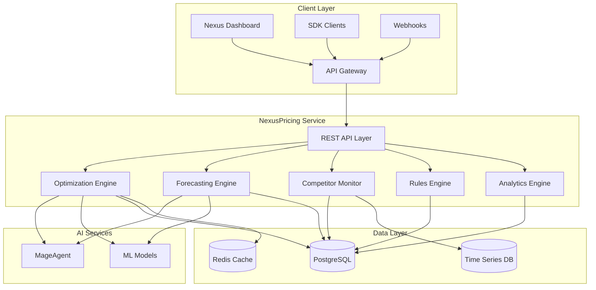
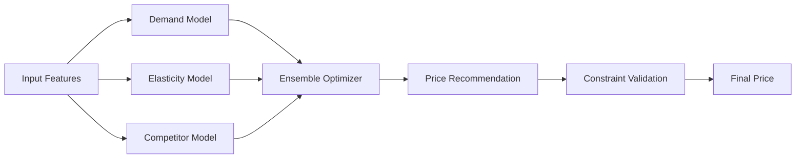
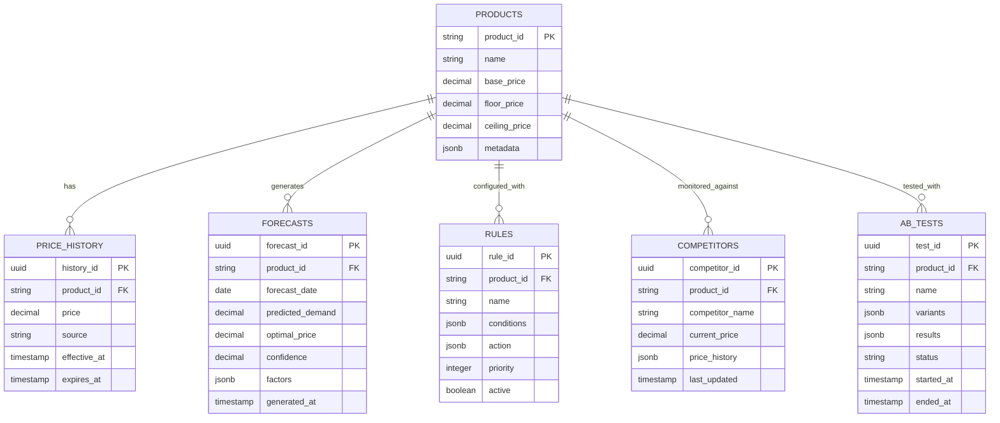
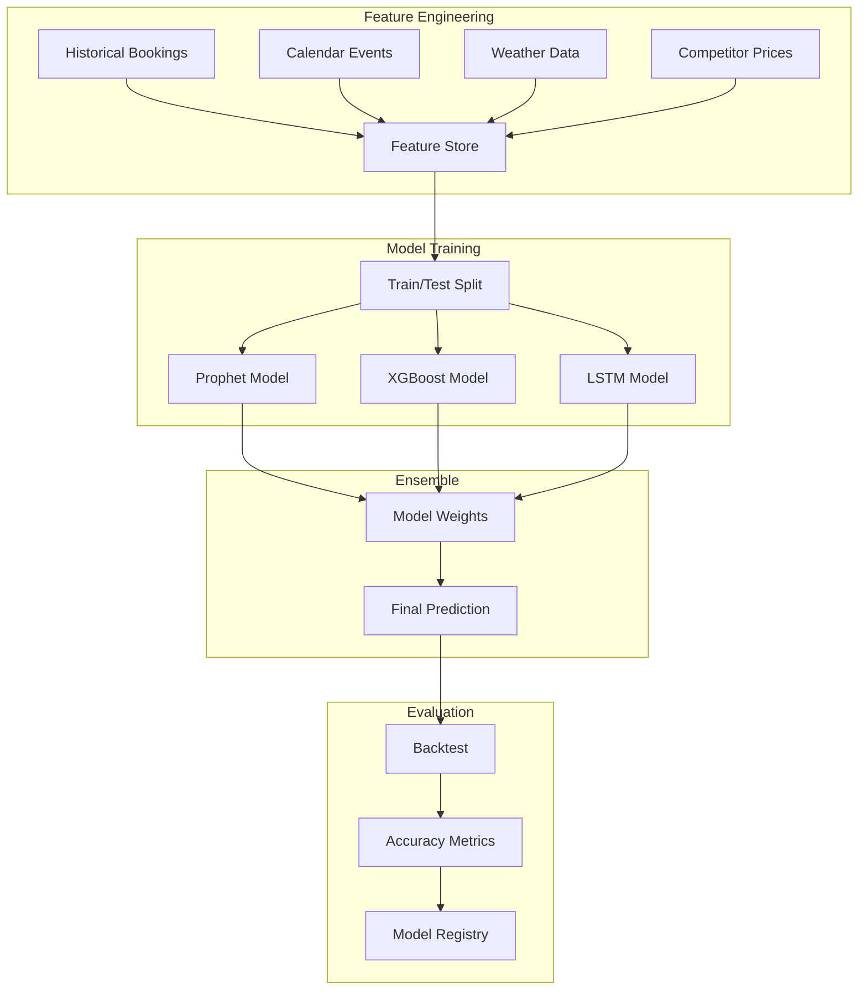
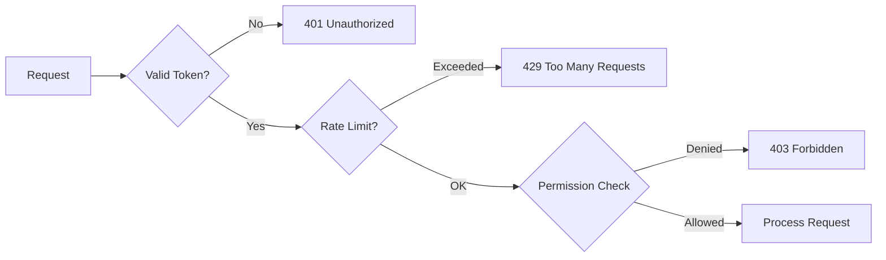
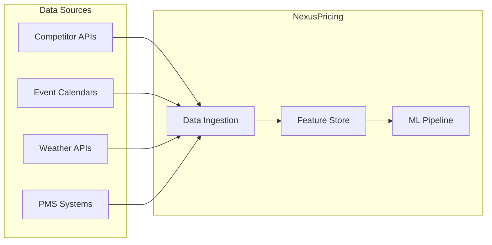

# NexusPricing Architecture

Technical architecture and system design for the AI-powered dynamic pricing platform.

---

## System Overview



---

## Core Components

### 1. REST API Layer

| Endpoint | Method | Description |
|----------|--------|-------------|
| `/api/v1/optimize` | POST | Get optimal price recommendation |
| `/api/v1/products/:id/analysis` | GET | Get product pricing analysis |
| `/api/v1/forecast` | POST | Generate demand forecast |
| `/api/v1/competitors` | GET | List competitor prices |
| `/api/v1/rules` | POST | Create pricing rule |
| `/api/v1/ab-tests` | POST | Start A/B test |
| `/api/v1/analytics/revenue` | GET | Get revenue analytics |

### 2. Optimization Engine

AI-powered price optimization using multiple models.

**Optimization Strategies:**
- Revenue maximization
- Occupancy optimization
- Profit margin optimization
- Competitive positioning

**Model Stack:**


### 3. Forecasting Engine

Time-series demand prediction with external factors.

**Features:**
- Multi-horizon forecasting (1-365 days)
- Seasonality decomposition
- Event impact modeling
- Weather correlation
- Market trend analysis

**Model Architecture:**
- Base: Prophet with custom seasonality
- Enhancement: XGBoost for external factors
- Ensemble: Weighted average with confidence

### 4. Competitor Monitor

Real-time competitive intelligence.

**Capabilities:**
- Hourly price scraping
- Rate parity detection
- Trend analysis
- Alert generation

### 5. Rules Engine

Business logic for automated pricing.

**Rule Types:**
- Time-based (day of week, season)
- Demand-based (occupancy triggers)
- Competitive (price matching)
- Event-based (local events)
- Custom (user-defined logic)

### 6. Analytics Engine

Comprehensive revenue analytics.

**Metrics:**
- RevPAR, ADR, Occupancy
- Price acceptance rate
- Rule effectiveness
- Forecast accuracy

---

## Data Model



---

## ML Model Architecture

### Demand Forecasting Model



### Price Elasticity Model

**Input Features:**
- Historical price-demand pairs
- Competitor price differentials
- Booking window
- Season/event flags
- Guest segment

**Output:**
- Elasticity coefficient
- Optimal price point
- Revenue curve

---

## Security Model

### Authentication
- Bearer token via Nexus API Gateway
- API key rotation support
- Webhook signature verification

### Authorization
- Role-based: Viewer, Analyst, Manager, Admin
- Product-level permissions
- Rate limit enforcement

### Data Protection
- Competitor data encryption
- Pricing strategy confidentiality
- Audit logging



---

## Deployment Architecture

### Kubernetes Configuration

```yaml
apiVersion: apps/v1
kind: Deployment
metadata:
  name: nexus-pricing
  namespace: nexus-plugins
spec:
  replicas: 3
  selector:
    matchLabels:
      app: nexus-pricing
  template:
    spec:
      containers:
      - name: pricing-api
        image: adverant/nexus-pricing:1.0.0
        ports:
        - containerPort: 8080
        resources:
          requests:
            memory: "2Gi"
            cpu: "1000m"
          limits:
            memory: "4Gi"
            cpu: "2000m"
        env:
        - name: ML_MODEL_PATH
          value: "/models"
        livenessProbe:
          httpGet:
            path: /live
            port: 8080
        readinessProbe:
          httpGet:
            path: /ready
            port: 8080
      - name: model-server
        image: adverant/nexus-pricing-ml:1.0.0
        ports:
        - containerPort: 8501
        resources:
          requests:
            memory: "4Gi"
            cpu: "2000m"
          limits:
            memory: "8Gi"
            cpu: "4000m"
```

### Resource Allocation

| Component | CPU Request | CPU Limit | Memory Request | Memory Limit |
|-----------|-------------|-----------|----------------|--------------|
| API Server | 1000m | 2000m | 2Gi | 4Gi |
| ML Server | 2000m | 4000m | 4Gi | 8Gi |
| Worker | 500m | 1000m | 1Gi | 2Gi |

---

## Integration Points

### External Data Sources



### Event Bus

| Event | Payload | Subscribers |
|-------|---------|-------------|
| `pricing.optimized` | Price recommendation | PMS, Analytics |
| `pricing.rule.triggered` | Rule details | Logging, Alerts |
| `pricing.competitor.changed` | Competitor update | Rules Engine |
| `pricing.forecast.generated` | Forecast data | Dashboard |

---

## Performance

### Rate Limits

| Tier | Requests/min | Price Updates/day | Forecast Requests |
|------|--------------|-------------------|-------------------|
| Starter | 60 | 100 | 50 |
| Professional | 300 | 10,000 | 500 |
| Enterprise | Custom | Unlimited | Unlimited |

### Latency Targets

| Operation | Target | P99 |
|-----------|--------|-----|
| Price Optimization | 100ms | 300ms |
| Demand Forecast | 500ms | 1500ms |
| Competitor Lookup | 50ms | 150ms |
| Rule Evaluation | 20ms | 50ms |

### Caching Strategy

- **Price cache**: 5 minute TTL
- **Competitor data**: 1 hour TTL
- **Forecasts**: 6 hour TTL (invalidated on new data)

---

## Monitoring

### Metrics (Prometheus)

```
# Optimization metrics
pricing_optimizations_total{product, strategy}
pricing_optimization_latency_seconds
pricing_recommendation_confidence

# Forecast metrics
pricing_forecast_accuracy{horizon}
pricing_forecast_latency_seconds

# Business metrics
pricing_revenue_impact{product}
pricing_rule_triggers_total{rule}
pricing_ab_test_conversions{test, variant}
```

### Alerting

| Alert | Condition | Severity |
|-------|-----------|----------|
| Model Degradation | Accuracy < 85% | Warning |
| Competitor Data Stale | No update > 4 hours | Warning |
| Price Outside Bounds | Price > ceiling or < floor | Critical |
| High Latency | P99 > 500ms | Warning |

---

## Disaster Recovery

- **RPO**: 1 hour (prices), 24 hours (models)
- **RTO**: 15 minutes (API), 1 hour (ML)
- **Model Rollback**: Previous version always available
- **Data Backup**: Hourly incremental, daily full

---

## Next Steps

- [Quick Start Guide](./QUICKSTART.md) - Get started quickly
- [Use Cases](./USE-CASES.md) - Implementation scenarios
- [API Reference](./docs/api-reference/endpoints.md) - Complete docs