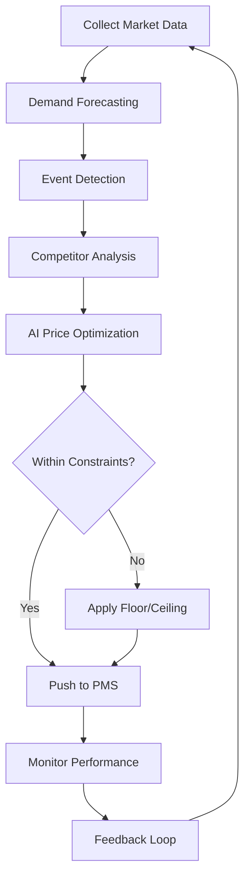
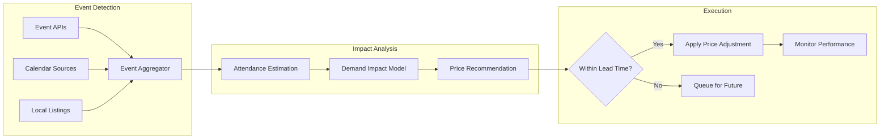

# NexusPricing Use Cases

Real-world implementation scenarios for AI-powered dynamic pricing and revenue optimization.

---

## Use Case 1: Vacation Rental Dynamic Pricing

### Problem

A vacation rental company with 200 properties prices manually based on gut feeling. They miss peak demand periods and leave money on the table during events.

### Solution

Implement real-time dynamic pricing that responds to demand signals, local events, and competitor pricing.

### Implementation

```typescript
import { NexusClient } from '@adverant/nexus-sdk';

class VacationRentalPricing {
  private pricing;

  constructor(nexusClient: NexusClient) {
    this.pricing = nexusClient.plugin('nexus-pricing');
  }

  async optimizePortfolioPricing() {
    // Get all properties
    const properties = await this.getProperties();

    const optimizations = await Promise.all(
      properties.map(async (property) => {
        // Get 30-day demand forecast
        const forecast = await this.pricing.forecast.create({
          productId: property.propertyId,
          forecastDays: 30,
          includeEvents: true,
          includeSeasonality: true,
          includeCompetitors: true
        });

        // Generate daily optimal prices
        const dailyPrices = await Promise.all(
          forecast.predictions.map(async (day) => {
            const optimization = await this.pricing.optimize({
              productId: property.propertyId,
              currentPrice: property.basePrice,
              date: day.date,
              constraints: {
                minPrice: property.basePrice * 0.7,
                maxPrice: property.basePrice * 2.5
              },
              factors: {
                demandForecast: day.predictedDemand,
                events: day.events,
                competitorPrices: day.competitorAverage
              }
            });

            return {
              date: day.date,
              price: optimization.recommendedPrice,
              confidence: optimization.confidence,
              factors: optimization.factors
            };
          })
        );

        return {
          propertyId: property.propertyId,
          prices: dailyPrices
        };
      })
    );

    // Push prices to booking system
    await this.pushPricesToPMS(optimizations);

    return optimizations;
  }
}
```

### Flow Diagram



### Business Impact

- **18% revenue increase** in first 90 days
- **23% RevPAR improvement** during peak periods
- **Automated pricing** for 200+ properties

---

## Use Case 2: Competitive Price Monitoring and Response

### Problem

A hotel loses bookings to competitors who undercut their rates. Manual competitor monitoring is slow and incomplete.

### Solution

Automated competitor monitoring with intelligent price response rules.

### Implementation

```typescript
class CompetitivePricingService {
  private pricing;

  constructor(nexusClient: NexusClient) {
    this.pricing = nexusClient.plugin('nexus-pricing');
  }

  async setupCompetitiveMonitoring(productId: string, competitors: string[]) {
    // Configure competitor tracking
    await this.pricing.competitors.configure({
      productId,
      competitors: competitors.map(c => ({
        name: c,
        matchingCriteria: 'similar_room_type',
        updateFrequency: 'hourly'
      })),
      alerts: {
        priceDropThreshold: 0.10, // Alert if competitor drops 10%+
        newCompetitorAlert: true
      }
    });

    // Create automated response rules
    await this.pricing.rules.create({
      name: 'Competitive Parity',
      productId,
      conditions: {
        competitorPriceBelow: 'market_average',
        occupancyBelow: 0.70
      },
      action: {
        type: 'match_competitor',
        target: 'lowest_competitor',
        modifier: -0.02 // 2% below lowest
      },
      constraints: {
        minPrice: 'floor_price',
        maxAdjustmentPercent: 0.15
      },
      priority: 2
    });

    // Create demand-based override
    await this.pricing.rules.create({
      name: 'High Demand Override',
      productId,
      conditions: {
        demandScoreAbove: 0.85,
        daysUntilStay: { lessThan: 7 }
      },
      action: {
        type: 'ignore_competitors',
        priceStrategy: 'maximize_revenue'
      },
      priority: 1 // Higher priority overrides competitive matching
    });
  }

  async handleCompetitorAlert(alert: CompetitorAlert) {
    // Analyze the competitive move
    const analysis = await this.pricing.analyze.competitorMove({
      productId: alert.productId,
      competitor: alert.competitorName,
      oldPrice: alert.previousPrice,
      newPrice: alert.currentPrice
    });

    // Get AI recommendation
    const recommendation = await this.pricing.optimize({
      productId: alert.productId,
      scenario: 'competitor_price_change',
      competitorContext: analysis
    });

    return {
      analysis,
      recommendation,
      autoApplied: recommendation.confidence > 0.85
    };
  }
}
```

### Business Impact

- **Real-time awareness** of competitor pricing
- **Automated response** to market changes
- **15% fewer lost bookings** to competitors

---

## Use Case 3: A/B Testing for Price Optimization

### Problem

Revenue team debates whether to raise or lower prices. No data-driven way to test price elasticity.

### Solution

Controlled A/B testing to measure actual demand response to price changes.

### Implementation

```python
from nexus_sdk import NexusClient
from datetime import datetime, timedelta

class PriceElasticityTesting:
    def __init__(self, nexus_client: NexusClient):
        self.pricing = nexus_client.plugin("nexus-pricing")

    async def run_elasticity_test(
        self,
        product_id: str,
        variants: list,
        duration_days: int = 14
    ):
        # Create A/B test
        test = await self.pricing.ab_tests.create({
            "name": f"Elasticity Test - {product_id}",
            "product_id": product_id,
            "variants": variants,
            "traffic_split": self.calculate_optimal_split(variants),
            "duration": duration_days,
            "success_metrics": [
                "conversion_rate",
                "revenue_per_visitor",
                "average_booking_value"
            ],
            "min_sample_size": 1000,
            "statistical_significance": 0.95
        })

        return test

    async def analyze_test_results(self, test_id: str):
        results = await self.pricing.ab_tests.results(test_id)

        if not results.is_significant:
            return {
                "status": "inconclusive",
                "recommendation": "Continue test or increase traffic",
                "current_sample": results.total_samples,
                "needed_sample": results.samples_for_significance
            }

        # Find winning variant
        winner = max(results.variants, key=lambda v: v.revenue_per_visitor)

        # Calculate elasticity
        elasticity = self.calculate_elasticity(results.variants)

        # Generate pricing curve
        pricing_curve = await self.pricing.analyze.elasticity_curve({
            "test_id": test_id,
            "results": results,
            "extrapolate_range": [0.8, 1.3]  # 80% to 130% of base price
        })

        return {
            "status": "conclusive",
            "winner": winner.name,
            "revenue_lift": winner.revenue_per_visitor / results.control.revenue_per_visitor - 1,
            "elasticity": elasticity,
            "optimal_price": pricing_curve.revenue_maximizing_price,
            "pricing_curve": pricing_curve.curve_data
        }

    def calculate_elasticity(self, variants):
        # Price elasticity of demand calculation
        control = next(v for v in variants if v.name == "control")
        test = next(v for v in variants if v.name != "control")

        price_change = (test.price - control.price) / control.price
        demand_change = (test.conversion_rate - control.conversion_rate) / control.conversion_rate

        return demand_change / price_change if price_change != 0 else 0
```

### Business Impact

- **Data-driven pricing decisions**
- **Measured 12% revenue opportunity** through testing
- **Reduced pricing debates** with objective data

---

## Use Case 4: Event-Based Dynamic Pricing

### Problem

Local events drive demand spikes, but pricing doesn't adjust. Staff miss events or react too late.

### Solution

Automated event detection and pricing adjustment.

### Implementation

```typescript
class EventBasedPricing {
  private pricing;

  constructor(nexusClient: NexusClient) {
    this.pricing = nexusClient.plugin('nexus-pricing');
  }

  async configureEventPricing(productId: string, location: string) {
    // Set up event monitoring
    await this.pricing.events.configure({
      productId,
      location,
      sources: [
        'concerts',
        'sports',
        'conventions',
        'festivals',
        'holidays'
      ],
      radiusMiles: 25,
      minAttendance: 5000
    });

    // Create event-based pricing rules
    const eventRules = [
      {
        name: 'Major Event Premium',
        conditions: {
          eventType: ['concert', 'sports', 'convention'],
          attendanceAbove: 20000
        },
        action: {
          type: 'percentage_increase',
          value: 0.40, // 40% increase
          applyDays: [-1, 0, 1] // Day before, day of, day after
        }
      },
      {
        name: 'Medium Event Premium',
        conditions: {
          eventType: ['concert', 'sports', 'festival'],
          attendanceBetween: [10000, 20000]
        },
        action: {
          type: 'percentage_increase',
          value: 0.25
        }
      },
      {
        name: 'Holiday Premium',
        conditions: {
          eventType: 'holiday',
          holidayType: ['major', 'long_weekend']
        },
        action: {
          type: 'percentage_increase',
          value: 0.30
        }
      }
    ];

    for (const rule of eventRules) {
      await this.pricing.rules.create({
        productId,
        ...rule,
        priority: 1,
        constraints: {
          maxPrice: 'ceiling_price',
          minAdvanceBooking: 0
        }
      });
    }
  }

  async getEventCalendar(productId: string, daysAhead: number = 90) {
    const events = await this.pricing.events.upcoming({
      productId,
      daysAhead,
      includeImpact: true
    });

    return events.map(event => ({
      name: event.name,
      date: event.date,
      type: event.type,
      expectedAttendance: event.attendance,
      pricingImpact: event.recommendedPriceIncrease,
      competitorResponse: event.competitorPriceChanges
    }));
  }
}
```

### Flow Diagram



### Business Impact

- **35% higher RevPAR** during events
- **Zero missed events** with automated detection
- **Captured $120K additional revenue** from 45 events

---

## Use Case 5: Revenue Analytics and Reporting

### Problem

Revenue team lacks visibility into pricing performance. Reports are manual and retrospective.

### Solution

Real-time revenue analytics with AI-powered insights.

### Implementation

```python
class RevenueAnalyticsDashboard:
    def __init__(self, nexus_client: NexusClient):
        self.pricing = nexus_client.plugin("nexus-pricing")

    async def get_executive_dashboard(self, period: str = "last_30_days"):
        # Aggregate revenue metrics
        revenue = await self.pricing.analytics.revenue({
            "period": period,
            "metrics": [
                "total_revenue",
                "rev_par",
                "adr",
                "occupancy",
                "revenue_per_available_unit"
            ],
            "compare_to": "previous_period",
            "group_by": ["product", "day_of_week", "booking_window"]
        })

        # Get pricing performance
        pricing_performance = await self.pricing.analytics.pricing({
            "period": period,
            "metrics": [
                "price_acceptance_rate",
                "optimization_compliance",
                "competitive_position",
                "rule_effectiveness"
            ]
        })

        # AI-generated insights
        insights = await self.pricing.insights.generate({
            "period": period,
            "focus_areas": [
                "missed_opportunities",
                "underperforming_products",
                "successful_strategies",
                "competitive_threats"
            ]
        })

        return {
            "summary": {
                "total_revenue": revenue.total_revenue,
                "vs_previous": revenue.period_comparison,
                "rev_par": revenue.rev_par,
                "adr": revenue.adr,
                "occupancy": revenue.occupancy
            },
            "pricing_health": {
                "optimization_score": pricing_performance.overall_score,
                "rules_active": pricing_performance.active_rules,
                "competitive_position": pricing_performance.market_position
            },
            "ai_insights": insights.key_findings,
            "recommendations": insights.action_items
        }

    async def generate_revenue_forecast(self, forecast_months: int = 3):
        forecast = await self.pricing.forecast.revenue({
            "forecast_months": forecast_months,
            "scenarios": ["conservative", "expected", "optimistic"],
            "include_factors": [
                "historical_trends",
                "seasonal_patterns",
                "event_calendar",
                "market_conditions"
            ]
        })

        return {
            "forecast": forecast.predictions,
            "confidence_intervals": forecast.confidence_bands,
            "key_assumptions": forecast.assumptions,
            "risk_factors": forecast.risks
        }
```

### Business Impact

- **Real-time visibility** into revenue performance
- **Proactive identification** of opportunities
- **Data-driven strategy** adjustments

---

## Integration with Nexus Ecosystem

| Plugin | Integration |
|--------|-------------|
| **PropertyMgmt** | Sync rates with PMS |
| **GuestExperience** | Guest value affects pricing |
| **InventoryAI** | Availability triggers price changes |
| **GraphRAG** | Store pricing knowledge |

---

## Next Steps

- [Architecture Overview](./ARCHITECTURE.md) - ML models and system design
- [API Reference](./docs/api-reference/endpoints.md) - Complete endpoint docs
- [Support](https://community.adverant.ai) - Community forum